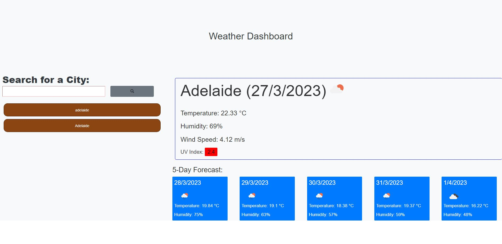

# Challenge 6 Weather API APPLICATION

This challange required students use apis to create an application that allows the user to input a city which returns a 5 day forcast along with a few more weather information.

Contains: - HTML - CSS - JavaScript

Link: https://github.com/RyanZade/Challenge-6.git

RyanZade
github link: https://github.com/RyanZade/Challenge-6
